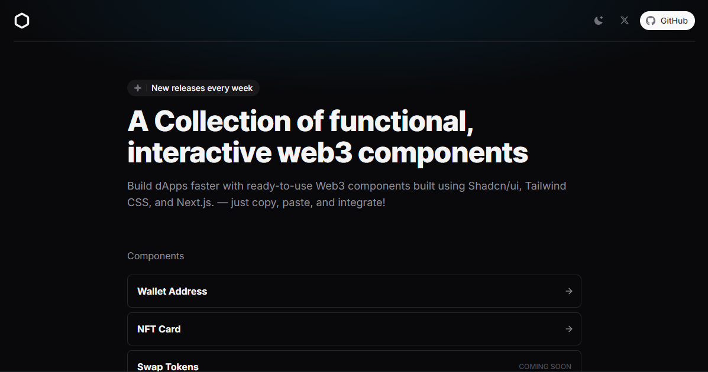

# BlockUI

A collection of beautiful, functional, and interactive Web3 components built with Next.js, Tailwind CSS, and Shadcn/ui. Designed to help developers build dApps faster with ready-to-use components.



## Features

- 🎨 Modern, responsive Web3 components
- 🌓 Dark/Light mode support
- ⚡ Built with performance in mind
- 🎯 Fully typed with TypeScript
- 📦 Easy to integrate
- 🔒 Secure by default
- 🎪 Interactive previews
- 📝 Comprehensive documentation

## Tech Stack

- [Next.js 15](https://nextjs.org/) - React Framework
- [TypeScript](https://www.typescriptlang.org/) - Type Safety
- [Tailwind CSS](https://tailwindcss.com/) - Styling
- [Shadcn/ui](https://ui.shadcn.com/) - Component System
- [Radix UI](https://www.radix-ui.com/) - Accessible Components

## Getting Started

BlockUI is designed to integrate seamlessly with Next.js projects, but the components are also compatible with any React-based project. You can directly copy and use the components in your project or you can also add the components using the `shadcn` cli.

Example -

```bash
npx shadcn@latest add https://blockui.xyz/r/wallet-address-01.json
```

## Contributing

We welcome contributions to Block UI! Please read our [contributing guidelines](CONTRIBUTING.md) on how to submit improvements and new components.

## Terms of Use

Feel free to use these components in personal and commercial projects. However, while the tutorials and demos are available for your use as-is, they cannot be redistributed or resold. Let’s keep things fair and respect each other’s work.

If you have any questions or just want to say hi, feel free to reach out to me on X 👉 [TheDreamyDev](https://x.com/thedreamydev).

## Notes

This project is a work in progress, and we’re continuously working to improve and expand this collection. We’d love to hear your feedback or see your contributions as the project evolves!

---

Made with ❤️ by [TheDreamyDev](https://x.com/intent/follow?screen_name=thedreamydev) for the Web3 Community.
